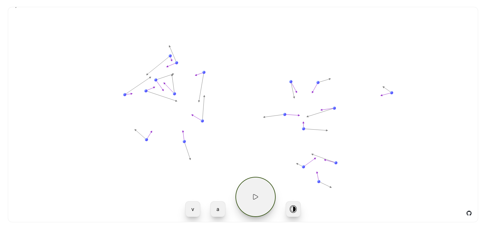

# sky


[sky](https://tedius-git.github.io/sky/) is a n-body simulation to play with. Build using lustre, gleam frontend framework.



## About

sky is a physics sandbox that lets you experiment with gravitational interactions between multiple bodies. Click and drag on the canvas to launch spheres, then watch as they attract each other according to Newton's law of universal gravitation.
Built with Lustre, a frontend framework for Gleam, a type-safe language that compiles to Erlang and JavaScript.

## TODO

- [ ] Adjustable gravity strength
- [ ] Body mass customization
- [ ] Trail visualization
- [ ] Save/load in local storage
- [ ] Performance optimizations for many bodies


## Development

### Nix

The proyect includes a flake.nix with a devshell with the dependencies. Run:

```bash
# Clone the repo
git clone https://github.com/tedius-git/sky.git

# Enter the devshell
nix develop

# Build and run
gleam run -m lustre/dev start
```


# Thanks to
- The awesome [Hayleigh Thompson](https://github.com/hayleigh-dot-dev) and all the contributors of [lustre](https://github.com/lustre-labs/lustre)
- The incredible [Louis Pilfold](https://github.com/lpil) and the team at [gleam](https://github.com/gleam-lang/gleam)
